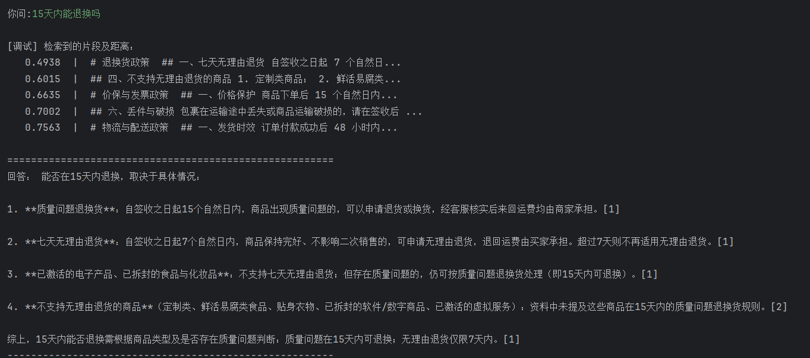
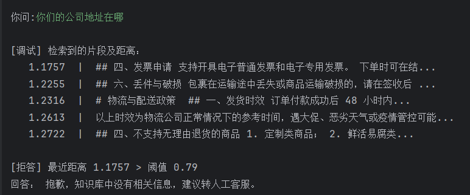

# 售后客服 RAG 问答助手

基于 LangChain + Chroma + DeepSeek 构建的售后客服知识库问答系统，
支持**引用溯源**与**无依据拒答**。

## 项目背景

电商售后场景中，客服需要频繁查阅退换货、物流、发票等政策文档。
通用大模型不了解企业私有规则，容易给出错误或编造的答复。

本项目通过 **RAG（检索增强生成）** 让模型只基于企业知识库作答，
并在知识库无依据时**主动拒答**，降低幻觉风险。

## 核心功能

| 功能 | 说明 |
|---|---|
| RAG 问答 | 基于私有知识库检索后生成答案 |
| **引用溯源** | 回答中标注来源编号 `[1][2]`，并列出原文片段 |
| **拒答机制** | 检索距离超过阈值时直接拒答，不调用大模型 |
| 交互式问答 | 命令行循环问答，支持多轮 |

## 技术栈

| 组件 | 选型 |
|---|---|
| 编排框架 | LangChain 1.x |
| 向量数据库 | Chroma |
| Embedding 模型 | BAAI/bge-m3（硅基流动） |
| 大语言模型 | DeepSeek-chat |
| 文档加载 | TextLoader + RecursiveCharacterTextSplitter |

## 效果演示
正常问答


无依据拒答



## 快速开始

```bash
# 1. 安装依赖
pip install -r requirements.txt

# 2. 配置环境变量
cp .env.example .env
# 编辑 .env，填入你的 API Key

# 3. 运行
python main.py

```

`.env` 需要这两个 Key：

| 变量名 | 用途 | 获取地址 |
|---|---|---|
| `DEEPSEEK_API_KEY` | 生成回答 | platform.deepseek.com |
| `SILICONFLOW_API_KEY` | 文本向量化 | siliconflow.cn |

## 实验数据

### 检索距离测试

**测试目的**：验证"有答案"与"无答案"的问题在检索距离上能否区分，
以此确定拒答阈值。

| 组 | 问题 | 第一行距离 |
|---|---|---|
| A（有答案） | 15天内能退换吗？ | 0.4850 |
| A（有答案） | 价保能保多久？ | 0.5841 |
| A（有答案） | 全国包邮吗？ | 0.7477 |
| B（无答案） | 你们支持货到付款吗？ | 0.8326 |
| B（无答案） | 你们用哪家快递？ | 0.8672 |
| B（无答案） | 你们的公司地址在哪？ | 1.1884 |

**结论**：A 组最大距离 0.7477，B 组最小距离 0.8326，两组零重叠。
取中间点 **0.79** 作为拒答阈值，6/6 测试样本判断正确。

### 参数配置

- 切分：`chunk_size=300`，`chunk_overlap=50`
- 检索：`k=5`
- 向量距离：Chroma 默认 L2

## 项目结构

```
after_sales_agent/
├── main.py                    # 主程序：加载 / 切分 / 建库 / 检索 / 生成
├── test_llm.py                # API 连通性测试
├── requirements.txt
├── .env.example               # 环境变量模板
├── data/policies/             # 知识库文档
│   ├── 退换货政策.md
│   ├── 物流与配送政策.md
│   └── 价保与发票政策.md
└── chroma_db/                 # 向量库（首次运行自动生成，不提交）
```

## 后续计划

- [ ] 封装为 FastAPI 接口
- [ ] 扩充评测集至 30–50 条，量化检索命中率与拒答准确率
- [ ] 引入 rerank 提升检索质量
- [ ] 加入订单查询工具，升级为 Agent